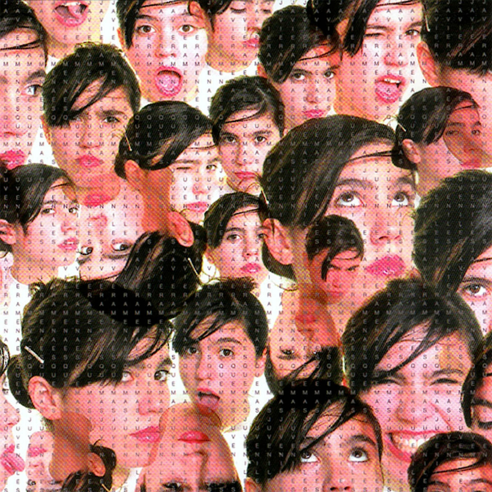
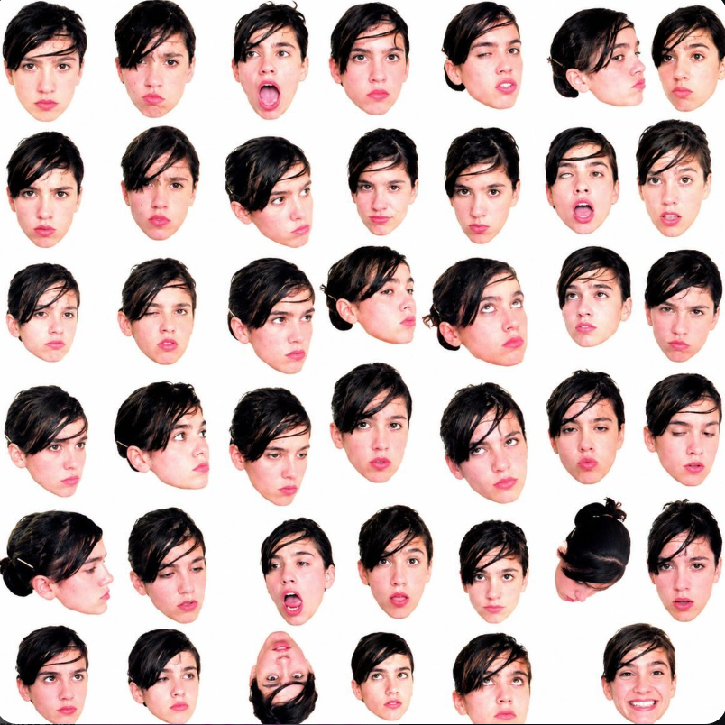

## Integrantes del grupo

- Rafaela Carrasco [cuentaGithub](https://github.com/rafaelacarrasco-pro)
- Sofía Reyes [cuentaGithub](https://github.com/sofiareyesantivil)

## Descripción del disco



- "Esquemas juveniles"
- 2006
- Javiera Mena
- Track list


```
1. Al siguiente nivel
2. Esquemas juveniles
3. Como siempre soñe
4. Sol de invierno
5. Camara lenta
6. casan (no puedo bloquear lo que puedo lo que quiero dar)
7. Cuando hablamos
8. Esta en tus manos
9. yo no te pido la luna
10. Perlas
```

- Aspecto del álbum a desarrollar (premisa)

> El proyecto trata de usar la cancion "Camara lenta", para hacer transiciones entre imagenes, siguiendo los ritmos y letras de cancion.


## Conclusión del proceso

- Distancia entre premisa y resultado

> En sí, logramos lo básico que queríamos hacer con la canción, como este efecto de que aparezcan las caras que aparecen en la foto del álbum de Javiera Mena de acuerdo al ritmo de la música, en conjunto con que las caras aumenten y disminuyan su tamaño a cierta velocidad lenta; lo mismo con la cámara que se sincroniza con la letra de la canción.
> 
> También logramos hacer que el sketch tuviera música, haciendo que la música inicie y se sincronice con el efecto de las caras que "pulsan" por decirlo de alguna forma.
> 
> En conjunto planeamos el sketch en forma análoga, haciendo un storyboard de cómo queríamos que se viera el sketch finalmente, donde nuestro foco principal era que aparecieran las caras de Javiera Mena con este efecto pulsante, y que estuvieran distribuidas en distintas partes. Como eran caras individuales y diversas, no ocupamos el comando random; realmente no sabíamos si eso serviría para tanto archivo .png, así que por esta razón cada una tiene una ubicación en específico que nosotras mismas elegimos, lo mismo para la otra parte del sketch, que son las mismas caras, solo que de un tamaño mucho más grande que las que aparecen al inicio.


- Cosas no conseguidas

> La mayor parte de cosas las conseguimos, pero hay otra como no, como por ejemplo teniamos planeado usar otro tiempo de font para la letra de la cancion que pusuimos en el sketch, no supimos como agregar eso al codigo y que funcionara, tambien que la cara de Javiera apareciera indivialmente sobre la letra 

- Descubrimientos al trabajar

> Descubrimos que podemos hacer funcionar un audio en p5.js, y lo incluimos en nuestro sketch.

## Explicación del código (3 aspectos)

> ocupamos let para determinar variables que seran utilizadas copn if, loadImage para hacer correr la imagen, loadsoun para la reproducion de la música, frameCount para la velocidad de movimiento de las cosas, mousePressed para la sincronizacion de las imagenes con la musica la clickear la pantalla.

### Bloque de código 1

> con este codigo determinamos variables y usamos function logrando la reproducion de la cancion en conjunto con las imagenes, haciendo click en pantalla.

```js
//  let musica;
 let empezar = false
 let tiempoInicial = 0;
musica = loadSound('audiojavi.mp3');

function mousePressed() {
 if (empezar === false) {
    empezar = true;
    
    tiempoInicial = millis()
    
    musica.play()
  }

```

### Bloque de código 2

> aquí igualmente determinamos la variable para las caras con el efecto pulsante y la disminucion y aumento de su tamaño como el tiempo en pantalla de cada una, don tam significa tamaño

```js
// let img1;
   img1 = loadImage('01.png');
let tam1 = 180 + sin(frameCount * 0.10) * 20;
push()
  if (tiempo >= 0 && tiempo < 5.5) {
    image(img1, width /2, height /2, tam1, tam1);}
    pop()
```

### Bloque de código 3

```js
//   if (tiempo >= 10 && tiempo < 12){
    fill(91, 71, 34) // VERDE OSCURO//
  textFont('Bebas Neue')
 textSize(30)
  text('｡𖦹°‧｡𖦹°‧｡𖦹°‧｡𖦹°‧｡𖦹°‧｡𖦹°‧｡𖦹°‧｡𖦹°‧｡𖦹°‧', width /2, height /2)}
  
```

### Declaración sobre el uso de IA

- IA utilizada(s) y tipo de licencia (pago, gratuita)

> Chatgpt gratis, Gemini pro gratis

- Problema a resolver a través de la IA

> Como nuestro foco eran las caras del album, le pedimos a Chatgpt que nos separara las caras de la imagen, le adjuntamos la foto original y nos separo cada cara, tambien buscamos como incluir la musica y que esta se sincronizara con la animacion al hacer click en pantalla, asi mismo buscamos como hacer el efecto de pulsasion en las caras.

- Prompts utilizados

> Prompt 1 : chatgpt nos separo las caras de la foto en base a este mensaje "necesito que separes todas las caras sin cambiarle la forma y consevando las facciones, y si esta sobrepuesta alguna completala", y nos dio toas las caras separadas en una misma imagem, hay caras que no salieron tan precisas a las facciones y expresiones, pero utilizamos que que mas se parecieran a las originales.
> 

> Prompt 2 : gemini nos ayudo a adjuntar todas las imagenes que necesitabamos y hacerlas funcionar en el sketch, el mensaje que le mandamos fue este, "estoy trabajando en un sketch animado en p5.js, puse en mi sketch imágenes, pero quiero que estas aparezcan simultáneamente, haciendo que las imagenes aparezcan una tras de otra en distintas partes del sketch, determinando un tiempo de inicio en pantalla a las imagenes y quiero que después de cierto tiempo desaparezcan del sketch", ahi gemini nos adjunto un codigo donde ocupamos if que determina el tiempo y posicion en pantalla de daca imagen.
> let tiempo = millis() / 1000; // Segundos transcurridos

  // Imagen 1: En pantalla desde el segundo 0 al 2
  if (tiempo >= 0 && tiempo < 2) {
    image(img1, 100, 100, 200, 200);

> Prompt : gemini ayudo a hacer este efecto de pulsasion en las caras, el mensaje que le mandamos fue, "como hago rebotar una imagen que se haga mas grande y chica susesivamente", donde gemin nos do todo un codigo de como hacerlo pero nosotras solo ocupamos lo escencial aprendiendo a como usarlo, nos explico que habia que determinar una variable para luego ocuparla con el if.
> el codigo era mas largo pero adjunte lo basico que ocupamos para guiarnos.

let posX;
let posY;
let velocidadX = 3; // Velocidad horizontal
let velocidadY = 2; // Velocidad vertical
let tamBase = 100;  // Tamaño base de la imagen

// Variable para el cambio de tamaño sucesivo
let anguloTamaño = 0;                                                                                                                                                                                                        // 1. LÓGICA DE MOVIMIENTO
  posX = posX + velocidadX;
  posY = posY + velocidadY;

  // 2. CALCULAR EL TAMAÑO OSCILANTE (Grande y chico)
  // sin() oscila entre -1 y 1. Lo mapeamos para que vaya entre 0.6 y 1.4 veces su tamaño
  let escala = map(sin(anguloTamaño), -1, 1, 0.6, 1.4);
  let tamActual = tamBase * escala;
  
  // Avanzamos el ángulo para el siguiente fotograma (controla la velocidad del cambio)
  anguloTamaño = anguloTamaño + 0.05; 

  // 3. LÓGICA DE REBOTE (Tomando en cuenta el tamaño actual para que no se corte)
  let radio = tamActual / 2;

  // Rebote en bordes izquierdo y derecho
  if (posX + radio > width || posX - radio < 0) {
    velocidadX = velocidadX * -1; // Invierte dirección horizontal
  }

- Secciones de código entregadas por la IA

```js
let miAudio;

function preload() {
  // 1. Cargar el audio antes de que arranque el sketch
  // Asegúrate de tener un archivo subido en tu proyecto
  soundFormats('mp3', 'ogg');
  miAudio = loadSound('mi-cancion.mp3'); 
}

function setup() {
  createCanvas(400, 400);
  background(30, 30, 30);
  fill(255);
  textSize(16);
  textAlign(CENTER, CENTER);
}

function draw() {
  background(30, 30, 30);
  
  // Mostrar estado del audio
  if (miAudio.isPlaying()) {
    text('Reproduciendo... Haz clic para pausar', width/2, height/2);
  } else {
    text('Haz clic para reproducir', width/2, height/2);
  }
}

// 2. Usar un evento para evitar el bloqueo del navegador
function mousePressed() {
  if (miAudio.isPlaying()) {
    miAudio.pause(); // Pausa el audio
  } else {
    miAudio.play();  // Reproduce el audio
  }
}
```
